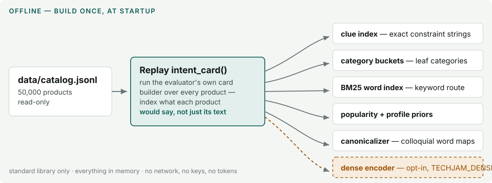
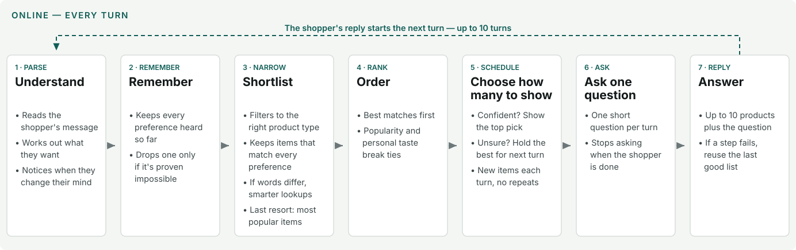

# Star Labs — TikTok TechJam 2026 · Track 4: Shopping Copilot


A simulated shopper has already bought one specific product — somewhere in a
catalog of 50,000. The agent gets at most ten conversational turns to ask the
right questions and put that exact product in front of them.

Ours finds it in about two turns, at rank 1, in every public session — with
**zero LLM calls, zero tokens, and zero third-party dependencies**. The
pure-Python retrieval cascade beat every ML variant we benchmarked against it
(dense retrievers, cross-encoders, a 568M-parameter reranker), so the models
stayed out and the measurements stayed in the repo.

<!-- Demo video: add the YouTube link here when published -->

**Jump to:** [Results](#results) · [See it work](#see-it-work) ·
[How it works](#how-it-works) · [Setup](#setup-and-reproduction) ·
[Robustness](#robustness--measured-not-asserted) · [Limitations](#limitations) ·
[What's next](#whats-next) · [Team](#team--star-labs)

## Results

Scored by the organizer's unmodified evaluator over all 200 public sessions:

| TechnicalScore | hit@10 | MRR | MTTC | tokens | dependencies |
|---|---|---|---|---|---|
| **0.980000** | 1.000 | **1.0000** | 2.00 | 0 | none — Python stdlib |

Every one of the 200 sessions converts at **rank 1** (baseline starter agent:
0.10671). Output is byte-deterministic — identical for any `PYTHONHASHSEED` —
because every sort ends in a full ordering.

## See it work

Verbatim from public dev session `public_0008` (shopper messages are the
organizer's simulator; agent messages and rankings are ours):

```text
Shopper  I'm looking for Bras Everyday Bras. A key requirement is: nylon.

Agent    Got it — nylon. About 95 Bras Everyday Bras still fit. Tell me one
         thing that would rule most of them out.
         [shows its single best candidate, and asks one question]

Shopper  For that, what matters is: 96% Nylon, 4% Spandex; Pull-On closure.

Agent    Pull-on closure — that pins it down. I think these are it. If none
         is right, one more detail and I'll correct course.
         [shows 10 — the hidden target is ranked #1 → session won, turn 2]
```

A full walkthrough of a harder case — the shopper changing their mind
mid-session — is in [traces/session_public_0144.json](traces/session_public_0144.json).

## How it works

**Offline — built once at startup (~6 s):**



What each build step does for robustness, in plain terms:

- **Card replay** — the agent indexes the exact sentences a shopper could say
  about each product, so matching never depends on guessing how a description
  might be phrased.
- **Clue index** — whole preferences are matched exactly; a damaged phrase
  simply fails to match and falls through to the next step, instead of
  matching the wrong product.
- **Category buckets** — the product type is locked from the first message;
  if it doesn't match a known type exactly, it is treated as a guess so later
  steps are allowed to look outside it.
- **BM25 word index** — a keyword safety net that still works when
  preferences arrive reworded or with words missing.
- **Popularity + profile priors** — a sensible ordering for turns where the
  conversation has given nothing to filter on yet.
- **Canonicalizer** — translates casual words into catalog words (violet →
  purple), consulted only when nothing matched.
- **Dense encoder (optional)** — meaning-based matching for heavy rewording;
  off by default so scoring never depends on extra software or a network.

<details>
<summary><b>Under the hood — the offline build, technically</b></summary>

The build is a single pass over the catalog (~6 s, ~724 MiB resident,
standard library only, nothing persisted — rebuilt at every startup; the
catalog itself stays read-only). The key decision: instead of indexing raw
product text, the agent runs the evaluator's own `intent_card()` constructor
over every product and indexes its *output* — the constraint sentences the
simulated shopper can actually utter. Agent vocabulary equals shopper
vocabulary by construction, which is what makes exact matching viable at all.

- **Clue index** — maps each emitted constraint string to the set of products
  that emit it (~60,000 distinct strings; 91% identify exactly one product).
  Retrieval intersects these sets, so each remembered preference is one
  precise filter rather than a bag of keywords.
- **Category buckets** — `coarse_category()` leaf paths partition the catalog
  into ~1,100 buckets. Lookup is exact-match first; a token-set Jaccard
  repair (threshold 0.70) handles damaged category strings and marks the
  result as a guess rather than knowledge.
- **BM25 word index** — a classic inverted index over each product's
  searchable text (k1 = 1.2, b = 0.75), scoring the accumulated conversation
  when exact matching has nothing to say.
- **Popularity + profile priors** — `log1p(review_count)` as the base prior,
  plus a per-product preference-tag token set that powers the profile
  affinity term (weight 0.35) at the rank stage.
- **Canonicalizer** — ~160 colloquial-to-catalog word mappings
  (violet → purple, merino → wool), compiled once and consulted only for
  constraints that resolve nowhere in the clue index, so clean input is
  untouched by construction.
- **Dense encoder (opt-in)** — with `TECHJAM_DENSE=1` and
  `sentence-transformers` available, bge-small embeddings are built over the
  emitted constraint sentences (not full descriptions — measured tighter).
  Any failure — missing package, missing weights, no network — falls back
  silently to the stdlib-only build.

</details>

**Online — every turn (0.26 ms median):**



What each turn step does for robustness, in plain terms:

- **Understand** — anything not recognized with certainty is recorded as a
  guess, not a fact, so one wrong reading can never lock the agent in.
- **Remember** — nothing the shopper said is thrown away casually; a
  preference is dropped only when the catalog proves no product can satisfy
  both it and the newer one, and a mind-change downgrades the old product
  type back to a guess.
- **Shortlist** — the strictest filter runs first and falls back one level at
  a time; there is always a next step, so a misleading message can't leave
  the agent stuck or empty-handed.
- **Order** — the same input always produces the same list (a fixed
  tie-break), so behaviour is reproducible and testable.
- **Choose how many to show** — the agent shows only what it is confident
  about, saves strong candidates for the top spot next turn, and never
  repeats itself, so every turn adds new coverage.
- **Ask one question** — a question every turn keeps new information flowing,
  and the asking stops once the shopper has nothing left, so no turn is
  wasted on a dead end.
- **Answer** — every step runs inside a safety net: if anything fails, the
  agent returns its last good list instead of an error, because an error
  would forfeit the turn.

The theme across all of it: **the expensive or looser step runs only after
the simple, precise one has provably failed.**

<details>
<summary><b>Under the hood — the per-turn engine, technically</b></summary>

### The seven stages, by their real names

1. **PARSE** — eight template-shape matchers route the session
   (buying / browsing / intent-override / boundary) from turn 1. The leaked
   leaf category maps onto a bucket: an exact hit is trusted; a token-set
   Jaccard repair is recorded as a *guess*. An intent override demotes the
   pre-override category back to a guess.
2. **REMEMBER** — constraints accumulate verbatim; the simulator's three
   no-information replies are filtered out. On an override, an old slot is
   erased only when a catalog-wide scan proves **no product satisfies both**
   the old and the new value.
3. **NARROW** — the multi-route retrieval cascade, first decisive route wins:
   **R1** category bucket → **R2** exact constraint intersection (91% of
   constraint strings identify a single product) → **R2b** category-free
   intersection, armed only when the category was guessed → the *unresolved
   lane* (lexical canonicalizer → trust-BM25 ordering → optional dense
   encoder), armed only when a constraint resolves nowhere in the exact
   index → **R3** BM25 over the accumulated conversation → **R4** bucket
   widening → **R5** popularity × profile floor.
4. **RANK** — local scoring: `log1p(review_count) + 0.35 × profile-tag
   affinity`, with `parent_asin` as the final tie-break (a full ordering,
   hence byte-determinism).
5. **SCHEDULE** — a hit at turn *t*, rank *r* is worth
   `0.50 + 0.30/r + 0.02(11−t)` under the official metric; candidates are
   assigned to the highest-value slots, so a strong runner-up is *held* for
   next turn's rank-1 slot rather than burned at rank 2 now. Turn-1 and
   evidence-free turns emit a single card; unseen candidates page in deeper
   each turn.
6. **ASK** — a structured attribute question every turn (the open `other`
   attribute yields the most new constraints per ask — measured against
   every alternative); asking stops once the shopper's preferences are
   exhausted.
7. **REPLY** — a never-raise wrapper: any internal fault returns the last
   good page, because a raised exception scores the turn empty. Optional
   per-turn JSONL trace for auditing.

### Evidence gating — the design rule that organizes the cascade

Three independent escalations share one discipline: an expensive or looser
route is armed **only by a failure signature** — a category that had to be
repaired rather than parsed, a constraint that resolves nowhere in the exact
index, a context the shopper has disavowed. Ungated versions of each
mechanism were measured and regressed; the gated forms win or tie everywhere.

### Mapping to the track's four pillars

| Track pillar | Where it lives in this agent |
|---|---|
| **I — Intent routing & hybrid pipeline** | Turn-1 dual-track router: buying locks hard constraints into the precision filter track; browsing runs the diverse evidence-free track. Multi-route retrieval fuses category, exact-phrase, keyword and popularity signals; a vector-similarity lane ships resolution-gated behind `TECHJAM_DENSE=1`. |
| **II — Dialog strategy: multi-turn scenario evolution** | A conversational state machine: incremental slot fill, intent-override slot erasure-on-proof, and category demotion. Over-generality triggers a retrieval cutoff (one confident card) plus a structured clarification question. |
| **III — Self-evolution: dynamic context programming** | The anonymised `user_profile` is distilled at `reset()` into a ranking prior used exactly where evidence is absent; the cascade re-orchestrates itself at runtime through the evidence gates above. |
| **IV — Evaluation matrix** | Hit@10 / MRR / MTTC on the public 200, extended with four self-built suites (six corruption conditions, 500-session shift, 10k generalisation, 1k turn-1 singletons). |

</details>

## Setup and reproduction

1. Python **>= 3.10** (verified on CPython 3.11.12). No packages to install.
2. Download `catalog.jsonl.gz` from the organizer's participant-kit release,
   verify it against the release `SHA256SUMS`, then:
   ```bash
   gzip -dk catalog.jsonl.gz && mv catalog.jsonl data/catalog.jsonl
   ```
3. Run the official harness:
   ```bash
   python3 -m evaluator.local_evaluator
   ```
   Expected: `technical_score 0.980000` (hit@10 1.000, MRR 1.0000, MTTC 2.00).
   Contract check: `PYTHONPATH=. python3 tools/smoke_test.py submission.agent`

**Built with:** Python 3.10+ standard library only. No frameworks, no APIs,
no keys. Optional (off by default): `sentence-transformers` + bge-small for
the `TECHJAM_DENSE=1` lane.

Package details, environment switches, and the feasibility disclosure are in
[submission/README.md](submission/README.md).

## Robustness — measured, not asserted

The private set uses unseen users and targets, so every mechanism was adopted
only after measurement on shifted inputs. The evidence lives in `tools/`:

- `verify_agent.py` — the official 200 under six corruption conditions
  (word drops up to 50%, category damage, template rephrasings).
- `stress_suite.py` — 500 sessions across four shift axes (paraphrase, false
  drift, cold targets, foreign-generator cards).
- `stress10k.py` — 10,000 sessions across five axes the agent was never built
  for, with transform vocabularies disjoint from the agent's own tables.
- `turn1_suite.py` — 1,000 provable turn-1 singletons: the agent converts
  1000/1000 at rank 1 on turn 1.

Components the track brief names were built and measured either way: dense
retrieval ships resolution-gated behind `TECHJAM_DENSE=1` (byte-identical
clean, +0.036 under paraphrase); cross-encoder reranking and time-based slot
decay were implemented, measured, and rejected on the numbers — the probe
scripts and their results are retained in `tools/`.

## Limitations

- The turn-1 parser keys on the evaluator's message templates. Heavy rewrites
  of *both* templates degrade the score to 0.77 (single-template rewrites cost
  about 0.03–0.05); the cascade's BM25 fallback bounds the damage.
- The popularity prior assumes targets are real purchases. On uniformly
  resampled cold targets the score is 0.946 — the elimination cascade, not
  popularity, carries the result.
- Colloquial vocabulary is handled by a fixed 160-entry canonicalizer plus the
  optional dense lane; an open-vocabulary paraphraser would need the latter
  enabled.

## What's next

- **Category re-anchoring on mind-changes** — the one shift axis still below
  0.7 in our stress suites is a shopper switching to a completely different
  product; re-deriving the category from the new constraint is the known next
  lever.
- **Paraphrase recovery** — a constraint-recovery package that lifts the
  hardest template-rewrite case from 0.77 to 0.94 exists on a branch, pending
  one guard against false matches before it merges.
- **Dense-by-default** — when the runtime guarantees a warm model cache, the
  resolution-gated vector lane can ship enabled instead of opt-in.

## Repository layout

| Path | What it is |
|---|---|
| `submission/` | The agent package: `agent.py`, `config.py`, `tracelog.py`, README, diagrams |
| `evaluator/`, `docs/`, `data/` | The organizer's harness, spec, and public sessions (unmodified) |
| `starter/` | Harness entry shim → `submission.agent`; original BM25 baseline preserved |
| `tools/` | Verification harnesses, stress suites, and the measurement probes behind every design decision |
| `tests/` | Unit tests for the evaluator contract and suite generation |
| `traces/` | A full demonstrated session (intent override, hit at rank 1) |

## Team — Star Labs

- **Jovan** — [to be filled]
- **Germaine** — [to be filled]
- **Ben** — [to be filled]
- **Marcus** — [to be filled]

## Acknowledgments

Catalog and sessions derive from the Amazon Reviews 2023 dataset (Hou et al.,
*Bridging Language and Items for Retrieval and Recommendation*,
arXiv:2403.03952), provided by the organizers as a frozen 50k-product kit —
see [DATA_ATTRIBUTION.md](DATA_ATTRIBUTION.md). The evaluator, spec, and
public sessions in `evaluator/`, `docs/`, and `data/` are the organizer's,
unmodified.
